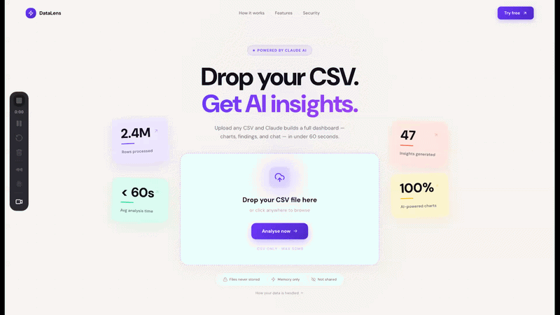

# DataLens — AI-Powered CSV Analytics Dashboard

Upload any CSV and get a full analytics dashboard — AI-selected charts, executive insights, and a live chat interface — in under 60 seconds.

Built for data analysts and business users who need answers fast without writing a single query.

---



---

## What It Does

1. **Drop a CSV** — any size up to 50 MB, any domain
2. **Claude analyses it** — identifies the domain, selects the most relevant charts, writes executive findings and data quality flags
3. **Explore the dashboard** — filter by any categorical column, chat with Claude about the data, export a Markdown report

Designed around one principle: **Claude owns domain knowledge; deterministic Python owns structural validation and safety.** Claude never touches raw data directly — it calls typed tool functions that validate inputs and return structured results.

---

## Tech Stack

| Layer | Technology |
|---|---|
| AI | Anthropic Claude API (claude-sonnet-4-6) with tool use |
| Backend | FastAPI · Pandas · Pydantic · slowapi |
| Frontend | React 19 · TypeScript · Vite · Tailwind CSS v4 |
| Charts | Recharts |
| Animation | Framer Motion |
| Streaming | Server-Sent Events (SSE) |

---

## Architecture

```
CSV Upload
    │
    ▼
┌─────────────────────────────────────────┐
│  Python profiler (deterministic)        │
│  Shape · dtypes · distributions ·       │
│  correlations · missing values          │
└───────────────┬─────────────────────────┘
                │ DataProfile (JSON)
                ▼
┌─────────────────────────────────────────┐
│  Claude tool-use loop                   │
│                                         │
│  Claude calls typed Python tools:       │
│  • get_column_stats(col)                │
│  • get_correlation_matrix()             │
│  • get_missing_summary()                │
│  • get_sample_rows(n)                   │
│  • compile_chart_spec(...)              │
│                                         │
│  Each tool validates inputs server-side │
│  and returns structured JSON — Claude   │
│  never receives raw dataframe objects.  │
└───────────────┬─────────────────────────┘
                │ AnalysisResult (JSON, streamed via SSE)
                ▼
┌─────────────────────────────────────────┐
│  React dashboard                        │
│  Insight cards · AI-selected charts ·   │
│  Column distributions · Chat interface  │
└─────────────────────────────────────────┘
```

**Why this design?** Letting Claude call structured tools (rather than write Pandas code) means Claude's outputs are always validated, typed, and safe. It also makes the analysis reproducible and auditable.

---

## How It Works

- **Upload** → FastAPI reads the CSV into a Pandas DataFrame stored in an in-memory session (UUID4 key, 24-hour TTL)
- **Profile** → A deterministic profiler computes shape, dtypes, distributions, correlations, and missing-value statistics
- **Analyse** → Claude runs a tool-use loop: it calls Python functions to inspect the data, then produces chart specs, insight cards, key findings, and data quality flags
- **Stream** → Results stream to the browser via Server-Sent Events so the dashboard fills in progressively
- **Chat** → Follow-up questions go to Claude with the full DataProfile as context; answers stream back in real time

---

## Local Setup

### Prerequisites
- Python 3.11+
- Node.js 18+
- An [Anthropic API key](https://console.anthropic.com)

### 1 — Clone and install

```bash
git clone https://github.com/<your-username>/claude-analytics-dashboard.git
cd claude-analytics-dashboard
make install-backend       # installs Python deps into .venv
cd frontend && npm install  # installs frontend deps
```

### 2 — Configure environment

```bash
cp backend/.env.example backend/.env
# Edit backend/.env and paste your ANTHROPIC_API_KEY
```

```bash
cp frontend/.env.example frontend/.env.local
# VITE_API_BASE_URL=http://localhost:8000 is already set correctly for local dev
```

### 3 — Run

```bash
# Terminal 1 — backend
make dev-backend    # starts FastAPI on http://localhost:8000

# Terminal 2 — frontend
cd frontend && npm run dev   # starts Vite on http://localhost:5173
```

Open `http://localhost:5173` in your browser and upload a CSV.

### 4 — Try the sample dataset

```bash
# Upload examples/showcase_data.csv for an instant impressive demo
```

---

## Sample Dataset

`examples/showcase_data.csv` is a synthetic 1 000-row employee analytics dataset with realistic structure and a deliberate signal: the Sales department has significantly lower satisfaction scores and higher attrition than the rest of the company — exactly the kind of finding a good dashboard should surface.

Regenerate it any time:

```bash
python examples/generate_showcase.py
```

---

## What I Learned

**Tool use is the right abstraction for AI + data.** Giving Claude structured Python functions to call — rather than free-form code generation — produces results that are safe, typed, and auditable. The tool boundary is where AI creativity meets engineering discipline.

**Streaming changes the UX completely.** SSE-based progressive rendering made the dashboard feel alive rather than frozen while Claude thinks. The 30–60 second analysis window feels fast when cards fill in one by one.

**In-memory sessions are a deliberate trade-off.** No database means no persistence, no migrations, no RLS to misconfigure — and no user data sitting in storage. For a tool that processes sensitive CSVs, ephemerality is a feature.

**Vibe-coded ≠ production-ready.** The gap between "it works on my machine" and "safe to push public" is real: missing rate limits, uncleaned temp files, orphaned components, and noise comments all accumulate quietly. A structured audit pass before launch is worth the hour.

---

## Project Structure

```
claude-analytics-dashboard/
├── backend/
│   ├── main.py               # FastAPI app, CORS, rate limiter
│   ├── routers/              # upload · analyze · chat · filter · aggregate · export
│   ├── services/
│   │   ├── claude_client.py  # tool-use loop, streaming analysis + chat
│   │   ├── profiler.py       # deterministic DataFrame profiler
│   │   ├── session_store.py  # in-memory session management (24h TTL)
│   │   └── chart_compiler.py # chart spec validation
│   └── models/schemas.py     # Pydantic request/response models
├── frontend/
│   └── src/
│       ├── components/       # Dashboard · ChartGrid · InsightCards · ChatInterface · …
│       ├── hooks/            # useAnalysis · useChat · useFileUpload
│       └── utils/api.ts      # typed fetch wrappers
└── examples/
    ├── showcase_data.csv     # sample dataset for demos
    └── generate_showcase.py  # reproducible generator (seed=42)
```

---

## Built With AI Assistance

This project was built using [Claude Code](https://claude.ai/code) and the Claude Design System as AI pair-programming tools. Claude helped with architecture decisions, code generation, design system creation, and security review — while all product decisions, prompting strategy, and project direction were driven by me.

This reflects how modern data professionals work: using AI as a force multiplier, not a replacement for domain expertise.

---

## License

MIT — see [LICENSE](LICENSE)
